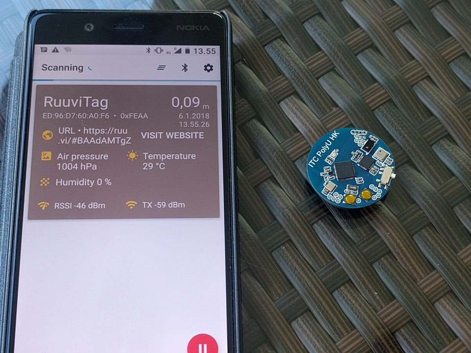

Firmware for a bluetooth beacon, like this  https://forum.mysensors.org/topic/6951/nrf5-multi-sensor-board-12-14

This firmware acts as a eddystone bluetooth beacon, announcing RuuviTag URLs (see https://tag.ruuvi.com/).
RuuviTag has different sensors and a more capable processor, so the source (https://github.com/ruuvi/ruuvitag_fw) does not fit for this beacon.

I don't know the origin of this beacon, but the "ITC PolyU HK" refers to a Hong Kong university. This beacon could be some kind of research project.

Beacon harware:
 * nRF51822QFAA (Cortex-M0, 16kB RAM, 256kb Flash, SPI, I2C, UART...)
 * Two buttons
 * RGB LED
 * MPU6050 accelerometer
 * AP3216C distance and ambient light sensor
 * BMP180 pressure and temperature sensor

Compiling requires: 
 * Linux
 * nRF5 SDK v11 https://developer.nordicsemi.com/nRF5_SDK/
 * ARM GCC, for example gcc-arm-none-eabi-5_2-2015q4
 * Segger JLINK or compatible
